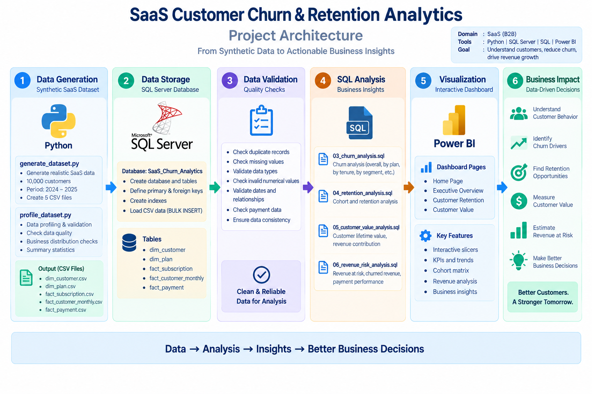
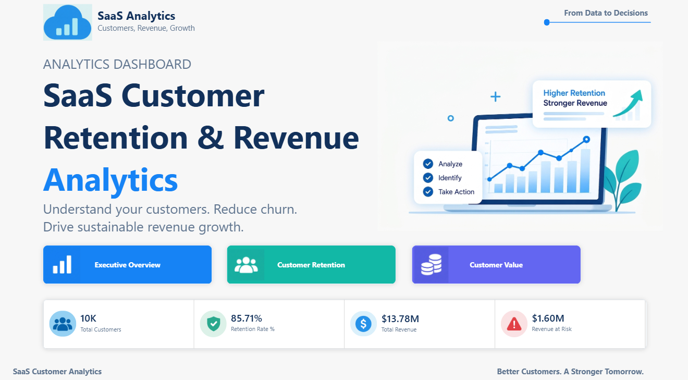
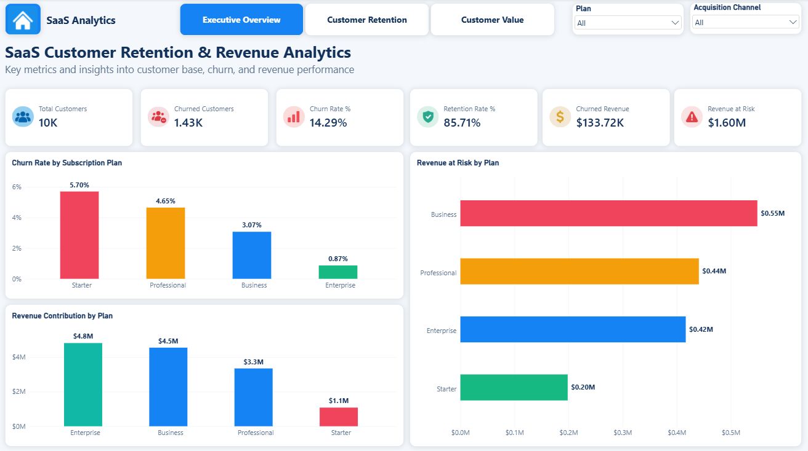
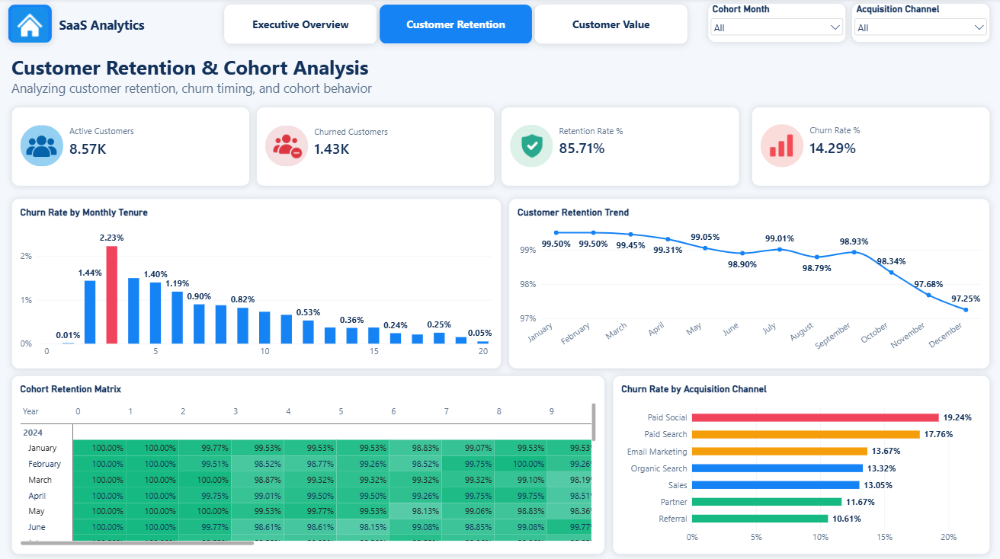
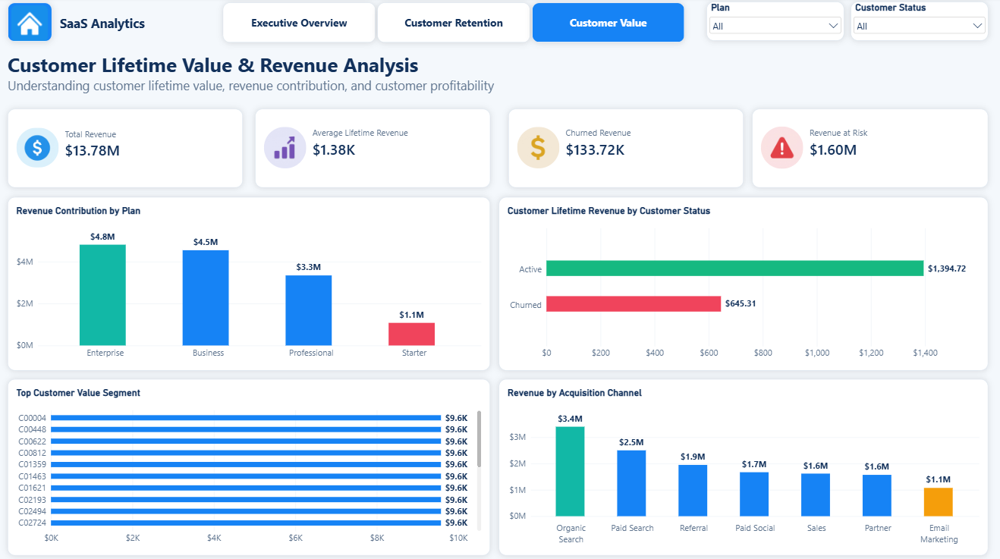

# SaaS Customer Retention & Revenue Analytics

> A data analytics project that analyzes customer churn, retention,
> customer lifetime value, and revenue at risk for a SaaS business.

------------------------------------------------------------------------

## Project Overview

SaaS companies need to understand why customers leave, which customer
segments have higher churn, how retention changes over time, and how
much revenue is exposed to churn.

This project builds an end-to-end analytics solution using **Python, SQL
Server, and Power BI** to transform customer, subscription, payment, and
monthly customer activity data into actionable business insights.

------------------------------------------------------------------------

## Business Problem

The SaaS business is experiencing customer churn and needs to
understand:

-   How many customers are churning?
-   Which subscription plans have the highest churn?
-   How is customer retention changing over time?
-   Which acquisition channels have higher churn?
-   Which plans contribute the most revenue?
-   How much revenue is currently at risk?
-   What is the lifetime revenue contribution of customers?

The goal is to provide a centralized analytical solution that helps
management identify retention problems and prioritize revenue-protection
opportunities.

------------------------------------------------------------------------

## Project Objectives

1.  Analyze customer churn and retention.
2.  Identify high-churn subscription plans.
3.  Analyze retention by customer tenure and cohort.
4.  Evaluate churn by acquisition channel.
5.  Measure customer lifetime revenue.
6.  Identify revenue contribution by subscription plan and acquisition
    channel.
7.  Quantify revenue at risk from churn.
8.  Build an interactive Power BI dashboard for business
    decision-making.

------------------------------------------------------------------------

## Project Architecture

The solution follows this workflow:

**Source Data → Python Data Generation/Preparation → SQL Server → SQL
Analysis → Power BI Dashboard**

### Architecture Diagram

```{=html}
<!-- Add your project architecture image here -->
```


------------------------------------------------------------------------

## Tech Stack

  Technology   Purpose
  ------------ ---------------------------------------------
  Python       Data generation, preparation and validation
  Pandas       Data processing
  SQL Server   Database storage and SQL analysis
  SQL          Data validation and business analysis
  Power BI     Interactive dashboard and visualization
  DAX          Analytical measures and KPIs
  GitHub       Version control and project documentation

------------------------------------------------------------------------

## Data Model

The SQL Server database contains the following tables:

### Dimension Tables

-   `dim_customer` --- Customer information
-   `dim_plan` --- Subscription plan information

### Fact Tables

-   `fact_subscription` --- Customer subscription history
-   `fact_customer_monthly` --- Monthly customer activity, revenue and
    churn indicators
-   `fact_payment` --- Customer payment transactions

### Main Relationships

-   `dim_customer` → `fact_subscription`
-   `dim_customer` → `fact_customer_monthly`
-   `dim_customer` → `fact_payment`
-   `dim_plan` → `fact_subscription`
-   `dim_plan` → `fact_customer_monthly`

------------------------------------------------------------------------

## Key Analysis Areas

### 1. Churn Analysis

Analyzes:

-   Total churned customers
-   Overall churn rate
-   Churn rate by subscription plan
-   Churn rate by customer tenure
-   Churn rate by acquisition channel

### 2. Retention Analysis

Analyzes:

-   Active customers
-   Retention rate
-   Monthly retention trend
-   Cohort retention
-   Customer retention behavior over time

### 3. Customer Value Analysis

Analyzes:

-   Total revenue
-   Average lifetime revenue
-   Customer lifetime revenue
-   Revenue contribution by plan
-   Revenue contribution by acquisition channel

### 4. Revenue Risk Analysis

Analyzes:

-   Revenue at risk
-   Churned revenue
-   Revenue at risk by subscription plan
-   Revenue contribution by plan

------------------------------------------------------------------------

## Power BI Dashboard

The dashboard contains four pages.

### 1. Home Page

Provides project navigation and high-level KPIs.

**KPIs:**

-   Total Customers
-   Retention Rate
-   Total Revenue
-   Revenue at Risk

```{=html}
<!-- Add Home Page screenshot here -->
```


------------------------------------------------------------------------

### 2. Executive Overview

Provides an executive-level view of customer churn and revenue
performance.

**KPIs:**

-   Total Customers
-   Churned Customers
-   Churn Rate
-   Retention Rate
-   Churned Revenue
-   Revenue at Risk

**Visuals:**

-   Churn Rate by Subscription Plan
-   Revenue at Risk by Plan
-   Revenue Contribution by Plan

**Filters:**

-   Plan
-   Acquisition Channel

```{=html}
<!-- Add Executive Overview screenshot here -->
```


------------------------------------------------------------------------

### 3. Customer Retention

Focuses on retention trends, churn timing and cohort behavior.

**KPIs:**

-   Active Customers
-   Churned Customers
-   Retention Rate
-   Churn Rate

**Visuals:**

-   Churn Rate by Monthly Tenure
-   Customer Retention Trend
-   Cohort Retention Matrix
-   Churn Rate by Acquisition Channel

**Filters:**

-   Cohort Month
-   Acquisition Channel

```{=html}
<!-- Add Customer Retention screenshot here -->
```


------------------------------------------------------------------------

### 4. Customer Value

Focuses on customer lifetime value and revenue contribution.

**KPIs:**

-   Total Revenue
-   Average Lifetime Revenue
-   Churned Revenue
-   Revenue at Risk

**Visuals:**

-   Revenue Contribution by Plan
-   Customer Lifetime Revenue by Customer Status
-   Top Customer Value Segment
-   Revenue by Acquisition Channel

**Filters:**

-   Plan
-   Customer Status

```{=html}
<!-- Add Customer Value screenshot here -->
```


------------------------------------------------------------------------

## Key Business Insights

The analysis highlights several important areas for management
attention:

-   The **Starter plan has the highest churn rate** among the
    subscription plans shown.
-   The **Enterprise plan has the lowest churn rate** and contributes
    the highest revenue among the plans shown.
-   **Paid Social has the highest churn rate** among the acquisition
    channels shown.
-   Revenue exposure is concentrated across the **Business and
    Professional plans**, making them important areas for revenue-risk
    monitoring.
-   Customer retention shows a **declining trend toward the later
    months** in the retention analysis.
-   Acquisition channels and customer tenure provide useful dimensions
    for identifying higher-risk customer groups.

For the detailed interpretation and recommendations, see
[`docs/business_insights.md`](docs/business_insights.md).

------------------------------------------------------------------------

## Documentation

  ----------------------------------------------------------------------------------------------
  Document                                                   Description
  ---------------------------------------------------------- -----------------------------------
  [`docs/data_dictionary.md`](docs/data_dictionary.md)       Definitions of important tables and
                                                             columns

  [`docs/business_insights.md`](docs/business_insights.md)   Business problem, findings and
                                                             recommendations

  [`docs/dashboard_guide.md`](docs/dashboard_guide.md)       Dashboard pages, KPIs, visuals and
                                                             filters

  `docs/project_architecture.png`                            Project architecture diagram
  ----------------------------------------------------------------------------------------------

------------------------------------------------------------------------

## SQL Analysis

The SQL scripts are organized by analytical purpose:

``` text
sql/
├── 01_database_schema.sql
├── 02_data_validation.sql
├── 03_churn_analysis.sql
├── 04_retention_analysis.sql
├── 05_customer_value_analysis.sql
└── 06_revenue_risk_analysis.sql
```

### Script Purpose

-   `01_database_schema.sql` --- Creates the SQL Server database,
    tables, constraints and indexes.
-   `02_data_validation.sql` --- Performs duplicate, null, numerical,
    date and payment validation checks.
-   `03_churn_analysis.sql` --- Analyzes customer churn.
-   `04_retention_analysis.sql` --- Analyzes customer retention and
    cohorts.
-   `05_customer_value_analysis.sql` --- Analyzes customer lifetime
    value and revenue contribution.
-   `06_revenue_risk_analysis.sql` --- Analyzes revenue exposed to
    churn.

------------------------------------------------------------------------

## Python

Python is used for dataset generation and preparation before loading the
data into SQL Server.

The Python source files are stored in:

``` text
src/
```

------------------------------------------------------------------------

## Data

The project uses structured SaaS customer data covering:

-   Customers
-   Subscription plans
-   Subscription history
-   Monthly customer activity
-   Payment transactions

The raw CSV files are stored under:

``` text
data/raw/
```

Large or generated datasets may be excluded from GitHub through
`.gitignore`.

------------------------------------------------------------------------

## Repository Structure

``` text
saas-customer-churn-analysis/
│
├── data/
│   └── raw/
│
├── docs/
│   ├── data_dictionary.md
│   ├── business_insights.md
│   ├── dashboard_guide.md
│   └── project_architecture.png
│
├── screenshots/
│   ├── 01_home_page.png
│   ├── 02_executive_overview.png
│   ├── 03_customer_retention.png
│   └── 04_customer_value.png
│
├── sql/
│   ├── 01_database_schema.sql
│   ├── 02_data_validation.sql
│   ├── 03_churn_analysis.sql
│   ├── 04_retention_analysis.sql
│   ├── 05_customer_value_analysis.sql
│   └── 06_revenue_risk_analysis.sql
│
├── src/
│   └── Python source files
│
├── .gitignore
├── README.md
└── requirements.txt
```

------------------------------------------------------------------------

## How to Reproduce the Project

### Step 1 --- Generate/prepare the data

Run the required Python scripts from the `src/` directory.

### Step 2 --- Create the SQL Server database

Run:

``` text
sql/01_database_schema.sql
```

This creates the `SaaS_Churn_Analytics` database and its tables.

### Step 3 --- Load the data

Load the generated CSV files into the corresponding SQL Server tables.

### Step 4 --- Validate the data

Run:

``` text
sql/02_data_validation.sql
```

### Step 5 --- Run the analysis

Execute:

``` text
sql/03_churn_analysis.sql
sql/04_retention_analysis.sql
sql/05_customer_value_analysis.sql
sql/06_revenue_risk_analysis.sql
```

### Step 6 --- Open the Power BI dashboard

Connect Power BI to the SQL Server database and refresh the model to
view the analytical dashboard.

------------------------------------------------------------------------

## Important Notes

-   Monetary values in the dashboard are presented in **US dollars
    (\$)**.
-   The dashboard is designed for analytical and portfolio demonstration
    purposes.
-   Raw/generated datasets may not be committed to GitHub when they are
    large.
-   SQL Server is the database used for this project.

------------------------------------------------------------------------

## Outcome

This project demonstrates an end-to-end data analytics workflow:

**Data Preparation → SQL Server Database → Data Validation → SQL
Analysis → Power BI Dashboard → Business Insights**

It combines data preparation, relational database design, SQL analysis,
KPI development, dashboard design, and business interpretation into a
single SaaS analytics solution.
